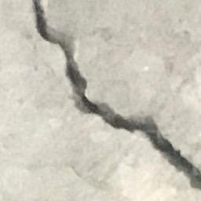
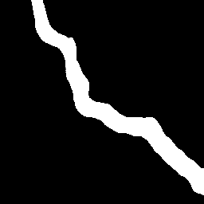
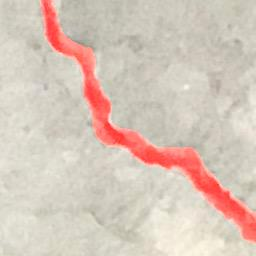

# Crack Segmentation in Concrete Surfaces

This repo includes the codes for segmentation of crack pixels in images of concrete surfaces. The network architecture is borrowed from [this repo](https://github.com/ternaus/TernausNet), which is a variant of U-Net with a VGG16 encoder. To train the model, we used the public dataset [Concrete Crack Segmentation Dataset](https://data.mendeley.com/datasets/jwsn7tfbrp/1).

| Image          |  Prediction | Overlaied image |
:-------------------------:|:-------------------------:|:-------------------------:|
 |  | 


# How to use it?

## 1. Clone repository

All necessary data and codes are inside the ``src`` directory. 

## 2. Install Conda or Miniconda

Link to install conda: https://docs.conda.io/projects/conda/en/latest/user-guide/install/windows.html

Link to install miniconda: https://docs.conda.io/en/latest/miniconda.html

## 3. Create a conda environment 


Run the following commands in your terminal to install and activate the environment.

```bash
conda env create -f environment.yml
```

```bash
conda activate crack_detection
```

> ⚠️ Note that depending on your GPU, you may need to install another version of **cudatoolkit**.


## 4. Create the dataset directory

The structure of the project directory is as follows: 
```
Stone-crack-segmentation
└───dataset
    └───train 
    └───train_GT 
    └───valid
    └───valid_GT
    └───test [optional]
    └───test_GT [optional]
└───models
└───logs
└───src
```
> ⚠️ It is recommended to use images of the height and width of 256 pixels for the trainig and validation splits.

## 5. Train a model

To train a deep model you can run the following command:
```bash
    python run.py --model_type=TernausNet16 --lr=1e-4 --weight_decay=0 --num_epochs=50 --pretrained=1  --batch_size=32
```
> ⚠️ You may want to decrease the ``batch_size`` if you face GPU memory issue.

## 6. Inference

Put imagaes that you want to predict cracks for in the directory ``./dataset/test``; and run

```bash
    python predict.py
```

This script will create a new folder called **predictions** in the project directory, in which the original test images, predicted binary cracks masks and overlaid cracks on top of images are saved. 

# Citation

The src codes in this repo are modified versions of the codes in the [Deep DIC Crack](https://github.com/amirrezaie1415/Deep-DIC-Crack) repo. 

If you find this implementation useful, please cite us as:
```
@article{REZAIE2020120474,
title = {Comparison of crack segmentation using digital image correlation measurements and deep learning},
journal = {Construction and Building Materials},
volume = {261},
pages = {120474},
year = {2020},
issn = {0950-0618},
doi = {https://doi.org/10.1016/j.conbuildmat.2020.120474},
url = {https://www.sciencedirect.com/science/article/pii/S095006182032479X},
author = {Amir Rezaie and Radhakrishna Achanta and Michele Godio and Katrin Beyer},
keywords = {Crack segmentation, Digital image correlation, Deep learning, Threshold method, Masonry},
}
```
